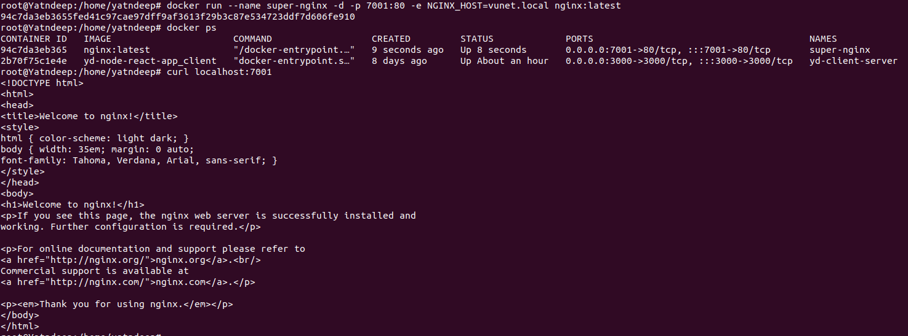

<!--Shree Ganeshay Namah -->
<div>

 
</div>


## <span style="color:darkblue"> 1. What is the relation between an image and a container in docker?

## Relation Between Image and Container

### Docker Image

An image is a lightweight, stand-alone, and executable software package that includes everything needed to run a piece of software, including the code, runtime, libraries, environment variables, and configuration files. Images are read-only templates used to create containers.

### Docker Container

A container is a runnable instance of an image. It encapsulates an application's code, dependencies, and configurations into an isolated unit that can run reliably in different computing environments. Containers are created from images and can be started, stopped, moved, and deleted.


*This image illustrates the process of creating multiple containers from a single Docker image. By using the `docker run` command with different names and options, you can run multiple isolated instances of the same application, ensuring scalability and reliability.*


## Comparison Table

| Aspect          | Docker Image                           | Docker Container                     |
| --------------- | -------------------------------------- | ------------------------------------ |
| Definition      | Read-only template with application code and dependencies | Runnable instance of an image        |
| State           | Immutable                              | Mutable (changes when running)       |
| Storage         | Stored on disk                         | Runs in memory and on disk           |
| Creation        | Built using Dockerfile or pulled from a registry | Created from a Docker image          |
| Lifecycle       | Build, Pull, Push                      | Create, Start, Stop, Restart, Remove |
| Persistence     | Persistent                             | Ephemeral (can be stopped and removed) |

## <span style="color:darkblue">2. List all the images and the containers in the system.

### Listing Docker Images and Containers

To list all Docker images and containers on your system, you can use the following commands:

### 2.1 Listing All Images

To list all Docker images on your system, use:

```bash
docker images
```


*All docker images listed of the system*


### 2.2 Listing All Containers 

#### 2.2.1 To list all containers, including running and stopped :

```bash
docker ps -a 
```

*All docker containers including stooped and running containers in the system.*

#### 2.2.2 To list all running containers
``` bash 
docker ps 
```


*All docker running containers in the system*

## <span style="color:darkblue">3. Pull the latest image of `nginx` and run it:
+ By naming the container `super-nginx`
+ By exposing the port on 7001 on the host.
+ In the detached mode
+ With the environment variable `NGINX_HOST` set to `vunet.local`


###  Pulling the Latest `nginx` Image and Running a Container

To pull the latest image of `nginx` and run it with the specified settings, follow these steps:

### a. Pull the Latest Image

First, pull the latest `nginx` image from Docker Hub:

```bash
docker pull nginx:latest
```

### b. Next , we will run a container with the specified configurations:

```bash
docker run --name super-nginx -d -p 7001:80 -e NGINX_HOST=vunet.local nginx:latest
```
### Breakdown of the command

- `--name super-nginx`: Names the container `super-nginx`.
- `-d`: Runs the container in detached mode.
- `-p 7001:80`: Maps port 7001 on the host to port 80 in the container.
- `-e NGINX_HOST=vunet.local`: Sets the environment variable `NGINX_HOST` to `vunet.local`.




## <span style="color:darkblue"> 4. Get the list of all running containers and stop and remove the `nginx` container


#### 4.1 List of running containers
```bash
docker ps
```


*All running containers*
#### 4.2 Stop and removing the ngnix container
```bash
docker stop super-nginx

docker rm super-nginx
```


*The super-nginx container which is created with the image nginx is stopped and removed.* 

## <span style="color:darkblue">5. Create a docker volume named `vunet`  and run `nginx` again, but this time, attach the volume created to the `/etc/` in the container.

#### 5.1 Let's create a docker volume named `vunet`
```bash
docker volume create vunet
```

*Docker volume named `vunet` is created.*

#### 5.2 Running nginx container with the attached volume to the `/etc/`

```bash
docker run -d --name nginx --mount source=vunet,target=/etc/ nginx
```

*Volume named `vunet` is mounted with the running container nginx*

## <span style="color:darkblue">6. Stop and remove the `nginx` container and remove the volume `vunet`

#### 6.1 Stop the nginx container
```bash
docker stop nginx
```


#### 6.2 Remove the nginx container

```bash
docker rm nginx
```


#### 6.3 Remove the volume vunet
```bash
docker volume rm vunet
```


## <span style="color:darkblue">7. Create a `Dockerfile` that :
Uses the latest `ubuntu` image
Install `python3.10` 
Copy the below python script into the image.
 
```python
    import http.server
    import socketserver
    from http import HTTPStatus
    
    
    class Handler(http.server.SimpleHTTPRequestHandler):
        def do_GET(self):
            self.send_response(HTTPStatus.OK)
            self.end_headers()
            self.wfile.write(b'Hello world')
    
    
    httpd = socketserver.TCPServer(('”', 8000), Handler)
    print("Serving Http Requests on 8000...)
    httpd.serve_forever()
```
Run the python file as the entrypoint

#### 7.1 Created a Dockerfile

```Dockefile
# Using the latest Ubuntu image
FROM ubuntu:latest

# Add deadsnakes PPA and install necessary packages
RUN apt-get update && apt-get install -y \
    software-properties-common && \
    add-apt-repository ppa:deadsnakes/ppa && \
    apt-get update && apt-get install -y \
    python3.10 \
    python3.10-venv \
    python3.10-dev

# Creating a working directory
WORKDIR /app

# Copy the Python script into the working directory
COPY script.py .

# Set the entrypoint to run the Python script
ENTRYPOINT ["python3.10", "script.py"]
```
#### 7.2 Created the file script.py and copied the given script in it.

#### 7.3 Building the docker image
```bash 
docker build -t yd-python-script-image .
```


#### 7.4 Docker Images where the yd-python-script-image is listed.


## <span style="color:darkblue"> 8. Run a container using the image created
#### 8.1 Running a container using image yd-python-script-image
```bash
docker run -d --name yd-python-script-container -p 8000:8000 yd-python-script-image
```


## <span style="color:darkblue"> 9. Check if the container is running and has the python process running

#### 9.1 Entered in the container to check the process is started.

#### 9.2 Now check the script output by the python script using :
```bash
curl localhost:8000
```


*The process is running as we can see it prints Hello World in the last line of attached image.*

## <span style="color:darkblue"> 10. Why are docker networks used? Create a docker network named `vunet`

#### 10.1 Docker Networks 

Docker networks are used to:

1. **Isolation and Security**: 
   - Segregate containers into isolated networks.
   - Enhance security and control access.

2. **Service Discovery**: 
   - Allow containers to discover and communicate by name.
   - Simplify network management.

3. **Communication Management**: 
   - Manage interactions between containers and the external world.

4. **Network Segmentation**: 
   - Create separate networks for different application tiers or environments.

5. **Ease of Configuration**: 
   - Simplify network setup with default and custom networks.

6. **Multi-Host Networking**: 
   - Enable communication between containers across different hosts using overlay networks.
#### 10.1.1 Just Exploring Why Docker networks used 
##### a. We have 2 containers running with the httpd image first one is on port `8001` and second one is on `8002`.


#### b. Now its time to check , Can they communicate between each other or not. So we will enter in the both of the containers .


*a.1 This is our container-1 and its ip is `172.17.0.2`.*


*a.2 This is our container-2 and its ip is `172.17.0.2`.*

###### We can see They are able to communicate between each other with their `IP Adresses and the port numbers`.


#### Now the problem is if the container get stopped and other container will start the `IP address` of the container will changed. So let's check can they communicate with their container names and ports.


#### <span style="color:red"> Ooops Its not working ...........</span>

#### Now what is the solution ??  
### <span style='color:green'> Obviously It's Docker Networking.

#### c. Lets create a docker network

##### Now we have DNSNames of the containers as `web-server-1` and `web-server-2` as per their container names.


### We are close to the solution ............. 


### Conclusion :
Docker networking addresses the issue of hardcoded IP addresses by using built-in DNS services, allowing containers to communicate using names instead of IPs. This dynamic DNS resolution means containers can discover each other by name, ensuring consistent connectivity even if container IPs change due to restarts or scaling. This approach simplifies configuration, enhances resilience, and improves the maintainability of containerized applications.

### 10.2 Now create a docker network named `vunet`.
```bash
docker network create vunet
```


*The docker network named `vunet` is created with the network id `cff5cb4eb938`.*

## <span style="color:darkblue"> 11. Again create a `nginx` cluster  by attaching the created network, `vunet`, to it.

#### 11.1 Lets create a `nginx` cluster and attach the created network `vunet` to it.

```bash
docker run -d --name nginx-1 -p 8081:80 --network vunet nginx 
docker run -d --name nginx-2 -p 8082:80 --network vunet nginx
docker run -d --name nginx-3 -p 8083:80 --network vunet nginx
```


#### 11.2 Now Inspect the network `vunet` which are the containers connected with it.
```bash
docker network inspect vunet | jq '.[0].Containers'
```


*Now we can see the nginx cluster is connected with the `vunet` docker network*


